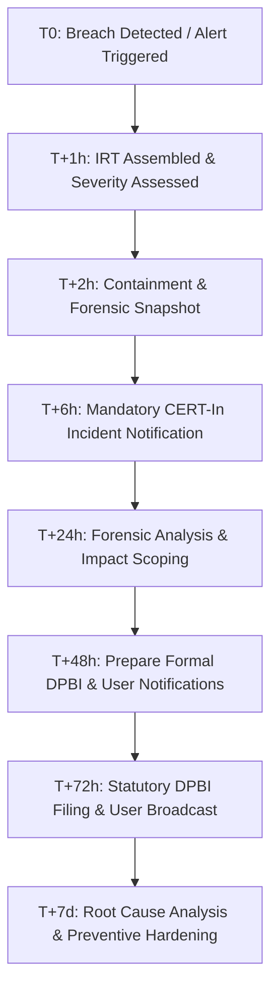

# SkandX Enterprise Data Breach & Incident Response Runbook

> **Standard Operating Procedure (SOP) & Statutory Incident Management**  
> **Regulatory Framework:** Digital Personal Data Protection Act, 2023 (Section 8(6)) | CERT-In Directions No. 20(3)/2022-CERT-In | SEBI Cyber Security & Resilience Framework  
> **Classification:** Internal Confidential / Compliance & Governance  
> **Version:** 2026.1 | **Last Updated:** October 1, 2026  

---

## 1. Overview and Purpose

Under **Section 8(6) of the Digital Personal Data Protection Act, 2023 (DPDP Act)** and statutory directions issued by **CERT-In (Indian Computer Emergency Response Team)**, SkandX Technologies Pvt. Ltd. (as Data Fiduciary) is under strict statutory obligation to notify the **Data Protection Board of India (DPBI)**, **CERT-In**, and **affected Data Principals (Users)** in the event of a personal data breach or cybersecurity incident.

This Runbook establishes immediate, repeatable forensic, containment, escalation, and communication protocols to safeguard user data, satisfy statutory reporting deadlines, and prevent cascading harm.

---

## 2. Emergency Incident Response Team (IRT)

| Role | Primary Responsibility | Emergency Contact |
| :--- | :--- | :--- |
| **Incident Commander (CTO)** | Technical lead, system isolation, containment authority | `incident-commander@skandx.in` |
| **Data Protection Officer (DPO)** | Regulatory reporting, DPBI notification, statutory compliance | `dpo@skandx.in` |
| **Lead Security Engineer** | Forensic analysis, log preservation, patch deployment | `security@skandx.in` |
| **Legal Counsel** | Regulatory liaising, legal copy clearance, statutory liability | `legal@skandx.in` |
| **Head of Customer Support** | Data Principal communications, support ticket triage | `support@skandx.in` |

---

## 3. Incident Severity Matrix & Statutory Timelines

```
+---------------------------------------------------------------------------------------+
| Severity Level | Definition & Examples                        | Statutory Deadlines   |
+---------------------------------------------------------------------------------------+
| P1 - CRITICAL  | Exfiltration of KYC (PAN/Aadhaar), passwords,| CERT-In: Within 6h    |
|                | bank details, or broad database compromise.  | DPBI: Within 72h      |
|                | Active unauthorized administrative access.   | Users: Promptly       |
+---------------------------------------------------------------------------------------+
| P2 - HIGH      | Session token compromise, targeted account   | CERT-In: Within 6h    |
|                | takeover, unauthorized withdrawal attempt.   | DPBI: Within 72h      |
+---------------------------------------------------------------------------------------+
| P3 - MEDIUM    | Upstream API service failure, brute-force    | Internal review       |
|                | threshold breaches, isolated phishing.       | Log retention: 180d   |
+---------------------------------------------------------------------------------------+
| P4 - LOW       | Unsuccessful vulnerability probe, blocked    | Standard monitoring   |
|                | DDoS attempt with zero data access.          | Log retention: 180d   |
+---------------------------------------------------------------------------------------+
```

---

## 4. Phase-by-Phase Incident Execution Flow



### Phase 1: Detection & Triage (Hour 0 – 1)
1. **Verification**: Confirm whether an alert represents a true personal data compromise or a false positive.
2. **Declaration**: Declare incident level (P1–P4) and summon the Incident Response Team via emergency pager.
3. **Chain of Custody**: Freeze write operations on compromised servers; initiate forensic disk and RAM snapshots.

### Phase 2: Containment & Isolation (Hour 1 – 3)
1. **Token Invalidation**: Terminate all active sessions immediately:
   ```sql
   DELETE FROM user_sessions;
   ```
2. **Credential Rotation**: Rotate database passwords, Redis authorization keys, JWT cluster secrets, and Firebase service account tokens.
3. **Network Quarantine**: Cut ingress/egress to affected pods/containers via VPC firewall rules while preserving forensic image state.
4. **Database Audit**: Verify PostgreSQL advisory transaction locks and check whether financial ledgers or balances were tampered with.

### Phase 3: Statutory Agency Notification (Hours 4 – 6)
- **CERT-In Reporting (6 Hours)**: Under CERT-In directions, dispatch initial security report to `incident@cert-in.org.in` using Form Incident Report (Annexure I).

### Phase 4: Forensic Scoping & Impact Analysis (Hours 6 – 36)
1. Determine exact count of compromised accounts (`SELECT COUNT(*) FROM ...`).
2. Identify specific data types affected (e.g., hashed credentials, KYC numbers, trade histories).
3. Confirm whether encryption keys were compromised.

### Phase 5: Statutory Filing with Data Protection Board (Hours 36 – 72)
- Submit formal breach disclosure to the **Data Protection Board of India (DPBI)** via official portal / email.

### Phase 6: Customer / Data Principal Notification (Hours 48 – 72)
- Deliver transparent, multi-channel notices (email + in-app alert banner) to all affected users with clear remediation steps.

---

## 5. Formal Notice Template: Data Protection Board of India (DPBI) & CERT-In

> **NOTICE OF PERSONAL DATA BREACH**  
> *(Under Section 8(6) of the Digital Personal Data Protection Act, 2023 & CERT-In Directions 2022)*

```text
To:
The Data Protection Board of India (DPBI) /
Indian Computer Emergency Response Team (CERT-In)
Ministry of Electronics and Information Technology (MeitY), Government of India

Subject: Formal Statutory Notification of Personal Data Incident — SkandX Technologies Pvt. Ltd.

1. DATA FIDUCIARY IDENTIFIERS:
   - Organization Name: SkandX Technologies Private Limited
   - Corporate Identity Number (CIN): [LEGAL REVIEW REQUIRED: CIN-U72900KA2026PTC000000]
   - Registered Office: Level 5, Cyber City, Bangalore, Karnataka 560100, India
   - Data Protection Officer (DPO): Mr. H. R. Sharma (dpo@skandx.in / +91 80 4567 8900)

2. INCIDENT SUMMARY:
   - Date and Time of Incident Detection: [YYYY-MM-DD, HH:MM IST]
   - Suspected Window of Occurrence: [YYYY-MM-DD to YYYY-MM-DD]
   - Incident Classification: [e.g., Unauthorized Database Exfiltration / Credential Stuffing / Upstream API Compromise]
   - Technical Vector: [Brief description of root cause vector, e.g., compromised third-party token or SQL injection attempt]

3. SCOPE AND NATURE OF PERSONAL DATA COMPROMISED:
   - Approximate Number of Data Principals Impacted: [Exact Count, e.g., 1,420 users]
   - Categories of Personal Data Involved:
     [ ] Basic Identifiers (Name, Email, Mobile Number)
     [ ] Identity / KYC Records (PAN Card Number, Aadhaar Reference ID, Document Images)
     [ ] Financial / Banking Details (Bank Account Numbers, IFSC, UPI IDs)
     [ ] Trading & Transaction History (Order ledgers, portfolio holdings)
     [ ] Cryptographic Credentials (Bcrypt hashed passwords, TOTP secrets)
   - Status of Encryption: [e.g., Passwords were salted and hashed with bcrypt (cost factor 10); database files encrypted at rest with AES-256]

4. POTENTIAL IMPACT & RISK ASSESSMENT:
   - Likelihood of Identity Theft / Financial Harm: [Low / Moderate / High]
   - Risk Evaluation Summary: [Detailed reasoning, e.g., No plaintext passwords or unmasked payment cards were exposed]

5. MITIGATION & CONTAINMENT ACTIONS EXECUTED:
   - [x] All active session tokens revoked across all devices (DELETE FROM user_sessions)
   - [x] Forced password reset and multi-factor re-verification triggered for all affected accounts
   - [x] Vulnerable endpoints isolated, patched, and verified through regression testing
   - [x] Master database and cloud API access keys rotated
   - [x] Digital forensic snapshots captured for independent cybersecurity audit

6. COMMUNICATIONS TO DATA PRINCIPALS:
   - Notification Method: Direct authenticated email to registered addresses and prominent in-app security alert banners.
   - Dispatch Schedule: Commenced on [YYYY-MM-DD, HH:MM IST].

7. CONTACT POINT FOR REGULATORY INQUIRIES:
   - Contact Person: Mr. H. R. Sharma (Grievance Redressal Officer & DPO)
   - Email: dpo@skandx.in / grievance@skandx.in
   - Direct Phone: +91 80 4567 8900

Submitted for and on behalf of SkandX Technologies Private Limited,
Authorized Signatory / Data Protection Officer
Date: [YYYY-MM-DD]
```

---

## 6. Formal Customer / Data Principal Incident Notification Template

> **EMAIL SUBJECT:** [IMPORTANT SECURITY NOTICE] Notice of Personal Data Incident Regarding Your SkandX Account  
> **SENDER:** `security@skandx.in` (Official Verification DKIM / SPF Signed)  

```text
Dear {{username}},

We are writing to inform you of a cybersecurity incident that may have involved some of your personal data on the SkandX trading platform. We take the privacy and confidentiality of your information with the highest degree of seriousness, and we are proactively notifying you in accordance with the Digital Personal Data Protection Act, 2023.

1. WHAT HAPPENED?
On {{incident_date}} at approximately {{incident_time}} IST, our security monitoring infrastructure detected unauthorized access targeting an isolated segment of our platform servers. Our cybersecurity team immediately executed emergency containment protocols, successfully isolated the affected systems, and severed all unauthorized access within {{containment_hours}} hours.

2. WHAT INFORMATION WAS INVOLVED?
Our forensic investigation indicates that the following information associated with your account may have been accessed:
- Account Details: Username, registered email address, and mobile phone number.
- Trading History: Recent order executions and paper trading simulation logs.

CRITICAL FINANCIAL & CREDENTIAL SAFEGUARDS:
- Your login passwords were NOT stored in plaintext and remain protected by cryptographic bcrypt salting and hashing.
- Your payment card numbers and net-banking passwords were NEVER stored on SkandX servers (all fund operations are processed through PCI-DSS Level 1 certified gateways).
- Core trading balances and financial ledgers remain completely intact and reconciled.

3. WHAT ACTIONS HAVE WE TAKEN?
- We have terminated all active login sessions and session tokens across all devices.
- We have patched and hardened the vulnerability exploited during the incident.
- We have notified the Data Protection Board of India and CERT-In in compliance with statutory reporting laws.
- We have engaged independent cybersecurity forensic specialists to conduct a comprehensive architecture audit.

4. WHAT ACTIONS SHOULD YOU TAKE?
While passwords were encrypted, as an immediate precautionary measure, we recommend taking the following steps:
1. Reset Your Password: When you next log in to SkandX, you will be prompted to establish a new, strong password. Please do not reuse passwords from other online services.
2. Verify Two-Factor Authentication (2FA): Ensure Google Authenticator (TOTP) or SMS 2FA is active on your account under Settings > Security.
3. Beware of Phishing Attempts: SkandX representatives will NEVER ask for your password, OTP, or PIN over phone, email, or WhatsApp. Do not click links claiming to offer compensation or fund returns from unofficial addresses.

5. FOR MORE INFORMATION & DEDICATED SUPPORT:
If you have any questions or wish to exercise your statutory rights to review your personal records under the DPDP Act, our dedicated privacy response team is available to assist you:
- Dedicated Security Helpline: 1800 123 4567 (Toll-Free, 9:00 AM – 9:00 PM IST)
- Official Email: grievance@skandx.in / dpo@skandx.in
- Grievance Redressal Portal: https://skandx.in/legal?tab=data-rights

We sincerely regret any inconvenience or concern this incident may cause, and we remain fully committed to protecting your trading experience with industry-leading security controls.

Sincerely,
The SkandX Security & Data Governance Team
SkandX Technologies Private Limited
```

---

## 7. Post-Incident Review & Remediation Action Plan

Within **14 business days** of containment:
1. **Independent Forensic Report**: Commission an external CERT-In empanelled auditor to produce an exhaustive Root Cause Analysis (RCA).
2. **Codebase Hardening Review**: Inspect all API endpoints for input validation, parameter binding, rate limiting, and fail-safe cryptographic error handling.
3. **Statutory Filing Closure**: File comprehensive incident closure documentation with the Data Protection Board of India.
4. **Log Retention**: Ensure all forensic disk images, packet captures, and server syslog records are retained in tamper-proof cold storage for a minimum of **5 years**.
